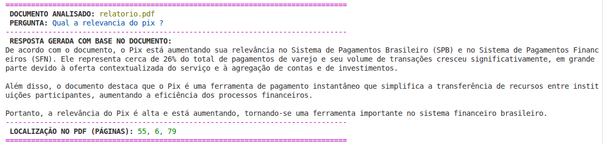
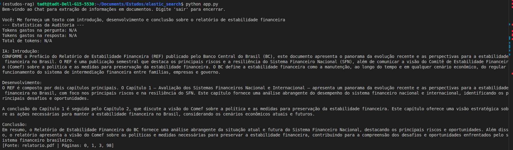

# Elasticsearch + RAG - Análise de Documentos - Estudo aplicado

Um projeto simples de busca e análise inteligente de documentos PDF utilizando **Elasticsearch** para armazenamento vetorial combinado com **LLMs** (Large Language Models) para geração de respostas contextualmente relevantes.

## Objetivo Principal

Implementar um sistema simples de **Retrieval Augmented Generation (RAG)** que permite:

- **Carregamento e processamento** de arquivos PDF
- **Busca semântica** em vetores de texto (embeddings)
- **Geração de respostas inteligentes** usando LLMs local (Llama 3.1)
- **Análise contextual** de documentos com referência às páginas de origem

Utilizado como exemplo: Relatório de Estabilidade Financeira Volume 24 | N.1| Abril 2025 ISSN 2176-8102

Exemplo de resultado com o main.py (v1):

- Recebe uma pergunta e analisa os documentos disponíveis



Exemplo de resultado com o app.py (v2):

- Recebe uma pergunta e analisa os documentos disponíveis
- Armazena o contexto para simular uma conversa
- Mantem a comunicação aberta



## Estrutura do Projeto

```
elastic_search/
├── main.py                      # Ponto de entrada do projeto v1
├── app.py                       # Ponto de entrada do projeto v2
├── rag_agent.py                 # Integtração com o modelo qwen2.5:latest (v2)
├── llm.py                       # Integração com o modelo qwen2.5:latest (v1)
├── vector_db_manager.py         # Gerenciador do Elasticsearch
├── search.py                    # Interface de busca e análise
├── load_file.py                 # Processador de arquivos PDF
├── docker-compose.yml           # Configuração da infraestrutura
├── requirements.txt             # Dependências Python
├── data/                        # Dados de entrada
│   └── dummy_data.json
├── docs/                        # Diretório para PDFs
│   └── relatorio.pdf            # Exemplo de documento
├── estudos/                     # Notebooks de aprendizado
│   ├── 04_create_index.ipynb
│   ├── 05_field_data_types.ipynb
│   ├── ...
│   └── 20_ingest_processors.ipynb
└
```

### Pré-requisitos

- Python 3.8+
- Docker e Docker Compose
- Qwen instalado localmente (para rodar os LLMs)

### Clonar/Acessar o Repositório

```bash
git clone https://github.com/biancalahm/rag-experiments.git

```

### Criar e Ativar Ambiente Virtual

```bash
# Criar ambiente
python3 -m venv venv

# Ativar (Linux/Mac)
source venv/bin/activate

```

### Instalar Dependências Python

```bash
pip install -r requirements.txt
```

**Dependências instaladas:**

```
langchain-core==0.x.x              # Base do LangChain
langchain-ollama==0.x.x            # Integração com Ollama
langchain-elasticsearch==0.x.x     # Conexão Elasticsearch
elasticsearch==8.x.x              # Cliente oficial
pypdf==4.x.x                       # Leitura de PDFs
langchain-community==0.x.x         # Loaders (PyPDFLoader)
langchain-text-splitters==0.x.x    # Divisor de texto
```

### Iniciar Infraestrutura (Docker)

```bash
# Inicia Elasticsearch 8.17.0 e Kibana 8.17.0
docker-compose up -d

# Verificar status
docker-compose ps

# Parar
docker-compose down
```

**Endpoints disponíveis:**

- Elasticsearch: `http://localhost:9200`
- Kibana: `http://localhost:5601`

### Configurar e Rodar Ollama

```bash
# Instalar e rodar Ollama (em outro terminal)
# Baixar modelos necessários
ollama pull qwen2.5:latest        # LLM para perguntas e respostas
ollama pull qwen3-embedding:0.6b  # Embedding para vetorização

# Ollama roda por padrão em http://localhost:11434
```

## Principais Modelos Utilizados

### LLMs (Large Language Models)


| Modelo                     | Função                                        | Provedor | Config                 |
| -------------------------- | ----------------------------------------------- | -------- | ---------------------- |
| **qwen2.5:latest**         | Análise de documentos e geração de respostas | Ollama   | `qwen2.5:latest`       |
| **Qwen3 Embedding** (0.6B) | Conversão de texto em vetores (embeddings)     | Ollama   | `qwen3-embedding:0.6b` |

### Backend de Dados


| Tecnologia        | Função                                  | Versão |
| ----------------- | ----------------------------------------- | ------- |
| **Elasticsearch** | Armazenamento vetorial e busca semântica | 8.17.0  |
| **Kibana**        | Interface para visualizar índices        | 8.17.0  |

### Frameworks/Bibliotecas


| Biblioteca                         | Função                                |
| ---------------------------------- | --------------------------------------- |
| **LangChain**                      | Orquestração de fluxo LLM + retrieval |
| **PyPDF**                          | Carregamento de documentos PDF          |
| **RecursiveCharacterTextSplitter** | Divisão inteligente de texto em chunks |
| **ElasticsearchStore**             | Integração de busca vetorial          |


## Fluxo de Processamento RAG

```
1. PDF Carregado
   ↓
2. Dividido em Chunks (512 tokens com overlap 200)
   ↓
3. Chunks Vetorizados com Qwen3 Embedding
   ↓
4. Armazenados no Elasticsearch (índice)
   ↓
5. Pergunta do usuário
   ↓
6. Busca Semântica (top-5 chunks similares)
   ↓
7. Contexto + Pergunta → qwen2.5:latest
   ↓
8. Resposta Gerada com Referências de Páginas
```

## Configurações Principais

### VectorDBManager

```python
.env
ELASTIC_SEARCH_URL
INDEX_NAME
EMBEDDING_MODEL
OLLAMA_MODEL
```

### PDFProcessor

```python
processor = PDFProcessor(
    vector_manager=db_manager,
    chunk_size=512,      # Tamanho dos pedaços de texto
    chunk_overlap=200    # Sobreposição entre chunks
)
```

### LLM (Llama 3.1)

```python
llm = Llm(model='qwen2.5:latest')  # Temperature=0 (respostas determinísticas)
```


### Notas

Este projeto é um estudo prático de:

- Elasticsearch (busca vetorial)
- LLMs com Ollama (inferência local)
- Padrão RAG (Retrieval Augmented Generation)
- LangChain (orquestração)

Desenvolvido como material  para análise de documentos inteligente.

**Última atualização:** May 2026
**Autor:** Bianca Lahm - Estudos - Elastic Search
